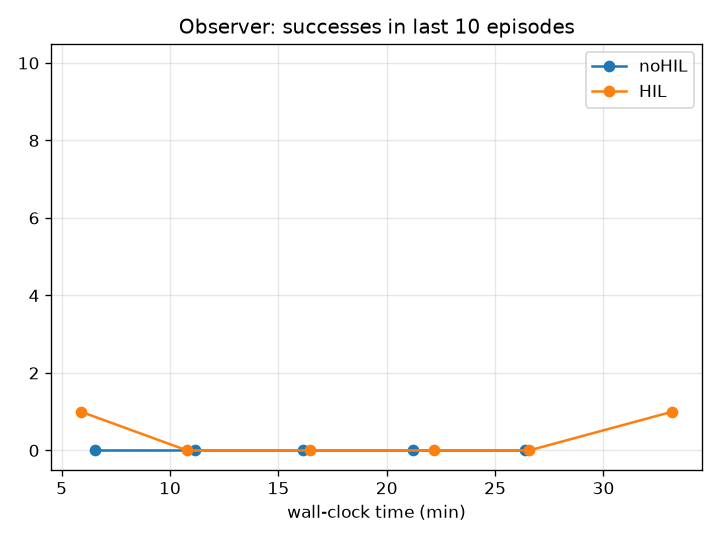
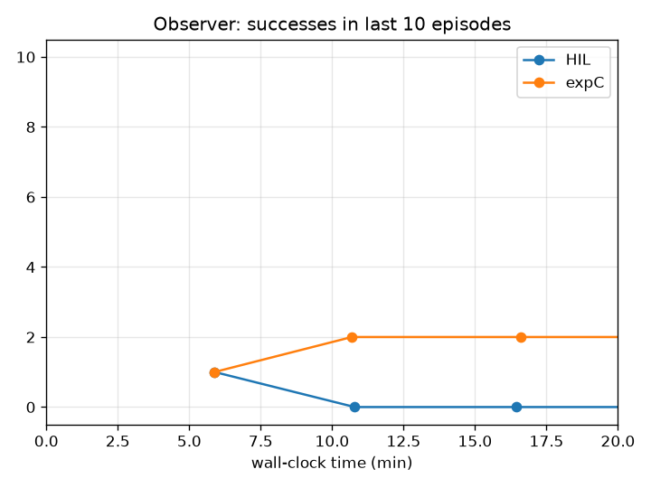

# TP HIL-SERL: report

**Group:** 

**Students: Nathanael/Gabriel** 

**Date:01/10/2026** 

**Device used (from `check_setup.py`): cpu** 

Replace every `...` with your answer. Insert figures from `runs/plots/` with ``. Keep the report under 6 pages when exported to PDF.

---

## Part 1: Discover the environment

**Human trials (1.2)**

| Operator | Attempt | Success (y/n) | Time (s) | What went wrong |
| --- | --- | --- | --- | --- |
| | 1 | n|10 | prise en main/trop long|
| | 2 | n|10|prise en main/trop long |
| | 3 | n|10 |prise en main/trop long |
| | 4 | n|10|prise en main/trop long |
| | 5 | n|10 |prise en main/trop long |
| | 1 | y|5.4 | X|
| | 2 | n|10 | trop long|
| | 3 | y|8.5 | X|
| | 4 | y|0.1 | X|
| | 5 | y|2.1 | X|

**Q1.1** L'espace d'observation comprend une vue du robot de face (robot + alentour + objet) et une vue au dessus de la pince du robot. Les 18 valeur contiennent probablement l'état du robot dont sa position. L'espace d'action que le robot voit effectivement est différent aavec 4 valeurs il peut se déplacer selon les 3 axes (x, y, z) et ouvrir ou fermer sa pince.

**Q1.2** C’est plus simple car l’agent donne directement le déplacement de la pince en x, y et z, au lieu de contrôler chaque articulation. Ensuite, le robot transforme ce déplacement en mouvements de ses articulations pour déplacer la pince au bon endroit.

**Q1.3** L’environnement donne une récompense de 1 en fin de tâche si elle est réussie, sinon la récompense est 0. La récompense est peu fréquente (sparse). Pour un agent qui explore au hasard, le problème est qu’il a très peu de chances d’obtenir une récompense et donc de savoir quelles actions étaient bonnes.

**Q1.4** Success rate: 40% ·Mean time to success: 4 s · Hardest phase: Pas vraiment de phase difficile une fois que l'on comprend comment diriger le bras, le plus difficile en soit c'est le temps limité d'un épisode.

---

## Part 2: Record demonstrations

Episodes recorded: 10 · Successful: 10 · Mean length: 3.1 s

**Q2.1** Un algorithme off-policy peut utiliser directement des démonstrations déjà enregistrées car il peut apprendre à partir de données collectées par une autre politique. Un algorithme on-policy comme PPO utilise normalement des données collectées par sa propre politique, donc il ne peut pas utiliser directement ces démonstrations.

**Q2.2** Démonstration utile : si la tache est réussi - si les mouvements sont simple et precis.

Démonstration nuisible : si on échoue - si trop de mouvement inutile.

**Q2.3** Sur seulement 10 démonstrations ont apprend à imiter les actions de la démos mais a la moindre petite erreur le robot peut se trouver dans une situation qu'il n'a jamais vue. C’est le problème de covariate shift : les situations rencontrées par le robot peuvent être différentes de celles présentes dans les données d’entraînement.

---

## Part 3: RL baseline without interventions

**Q3.1** α contrôle l’importance de l’exploration. Si α est trop élevé le robot explore beaucoup et ses actions sont plus aléatoires. Si α est trop faible il explore moins et peut avoir du mal à découvrir de bonnes actions. Ici α = 0.01 donc l’exploration a un poids relativement faible.

**Q3.2** utd_ratio = 2 signifie que l’algorithme fait environ 2 mises à jour pour chaque nouvelle donnée collectée. Cela permet de réutiliser plusieurs fois les mêmes données ce qui rend l’apprentissage plus efficace et permet d’apprendre davantage avec moins de données.

**Q3.3** Si le délai est long, l’acteur continue de collecter des données avec d’anciens poids, donc avec une politique qui n’est plus à jour. SAC est assez robuste à cela car c’est un algorithme off-policy : il peut apprendre avec des données collectées par une ancienne politique.

**Q3.4** Avantage : entrainement plus rapide.

Inconvénient : il ne peut pas s'adapter à la tache.

**Q3.5** γ¹⁰⁰ = 0,048 · Implication: la récompense finale est fortement diminuée au début ce qui rend l’apprentissage plus difficile avec une récompense sparse.

---

## Part 4: HIL-SERL with interventions

| Run | First success (min) | Min to rolling reward ≥ 0.8 | Interventions | Human effort (s) |
| --- | --- | --- | --- | --- |
| noHIL | 1.1| X| 0 | 0 |
| HIL | 1.2| X| 3| 300|

**Q4.1** Le run noHIL a eu sa première réussite à 1,1 min et le run HIL à 1,2 min. Aucun des deux n’a atteint 8/10 succès. Le PC étant lent, il y a eu peu d’épisodes pendant les 25 minutes, ce qui limite cette comparaison.

**Q4.2** Non, le taux d’intervention n’a pas vraiment diminué. J’ai dû intervenir plusieurs fois pendant le run, car le robot continuait à s’éloigner du cube. Le nombre d’épisodes étant faible à cause des ralentissements du PC, la stratégie n’a pas eu beaucoup de temps pour s’améliorer.

**Q4.3** Metric proposed: X · Value for our HIL run: X

Effort humain total : 300 s (5 min). Comme il n’y a eu qu’un seul succès, il est difficile de dire si cet effort en valait la peine.

**Q4.4** Une transition est marquée comme intervention avec TeleopEvents.IS_INTERVENTION. Elle est alors ajoutée au replay_buffer principal et au offline_replay_buffer. Les transitions normales vont seulement dans le replay_buffer.

**Q4.5** C’est plus proche de DAgger car l’humain corrige le robot dans les situations où le robot se trompe, puis son action est enregistrée. On apprend donc à partir des erreurs du robot et pas seulement à partir de démonstrations préparées à l’avance.

---

## Part 5: Experiment ___

**Q5.1 Hypothesis (written before the run):** Fewer, noisier demos slow down learning.

| Run | First success (min) | Min to rolling reward ≥ 0.8 | Interventions | Human effort (s) |
| --- | --- | --- | --- | --- |
| HIL (first 20 min) | 1.2| X| 3|300 |
| exp C |1.0 | X|3 | 360|

**Q5.1 Result:** la première réussite a eu lieu à 1,0 min. Il y a eu 3 interventions pour 360 s d’effort humain. Le taux de réussite observé sur les fenêtres de 10 épisodes est monté jusqu’à 2/10. Une des interventions à était a la base de la deuxième réussite les restantes on à tenter d'intervenir au minimum.

**Q5.2** L’hypothèse n’est pas vraiment confirmée par ce run. La première réussite arrive à 1,0 min avec expC, contre 1,2 min avec HIL. Avec un seul run par condition et peu d’épisodes, on a donc une faible confiance dans la conclusion. Pour avoir un résultat plus solide, il faudrait faire plusieurs runs pour chaque condition, avec les mêmes paramètres et conditions puis comparer et dans notre cas on aurait peut être du laisser tourner plus de 25 minutes. (le noHIL n'a eu au total que 11 épisode sur 25 min, les deux autres probablement dans le même ordre de grandeur en terme d'épisode sur 25 min )

---

## Part 6: Class comparison

**Q6.1** ...

**Q6.2** HIL-SERL est une méthode de reinforcement learning avec un humain qui peut intervenir pour corriger le robot. HG-DAgger utilise aussi un humain, mais suppose qu’il peut donner la bonne action dans les situations où le robot ne sait pas quoi faire. HIL-SERL apprend surtout des corrections faites pendant que le robot essaie la tâche, donc des situations où il fait des erreurs.

**Q6.3** Si on se base sur le tp en réel la récompense viendrai d'un capteur (caméra par exemple)  partir d'une condition pour vérifier si la tâche est réussie. Le problème est que le capteur peut se tromper et donner une récompense alors que la tâche est ratée, ou ne pas en donner alors que la tâche est réussie.

**Q6.4** L’humain peut rendre l’apprentissage moins bon en intervenant trop tard, en donnant des actions différentes pour une même situation, ou en intervenant trop longtemps au lieu de laisser le robot apprendre.

**Q6.5** On pourrait faire en sorte que le robot demande de l’aide s’il reste bloqué pendant un certain temps. L’humain interviendrait seulement quand c’est nécessaire, ce qui réduirait son temps de travail.
